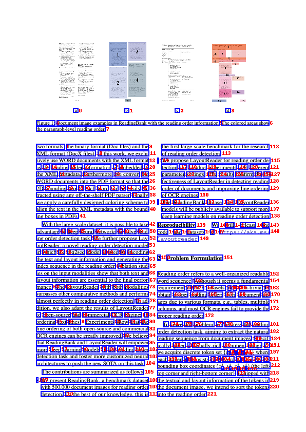
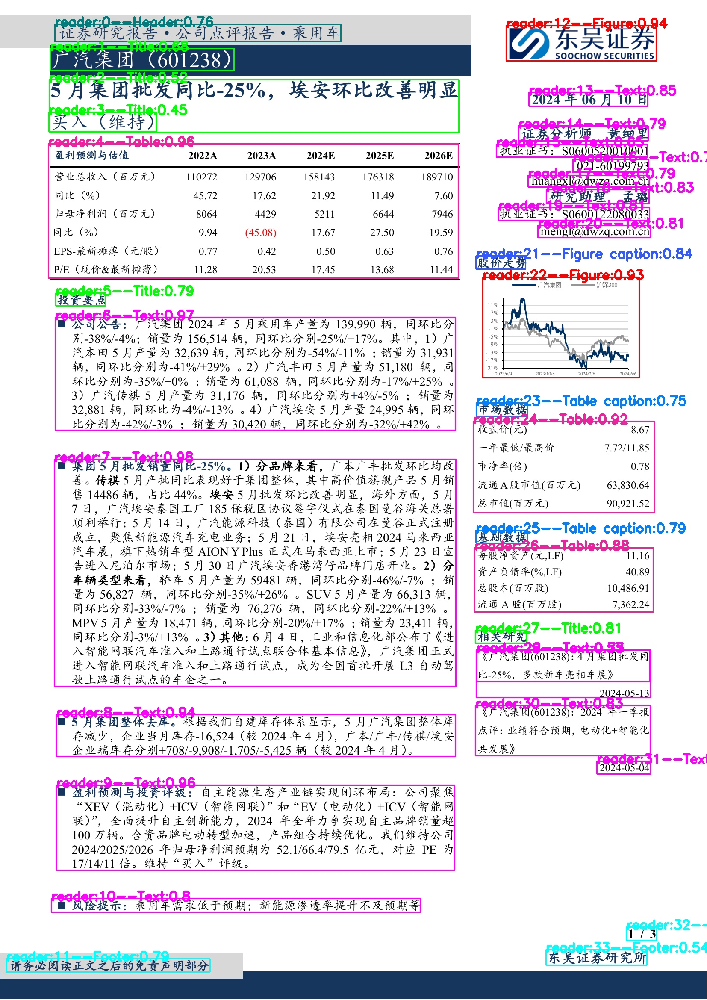
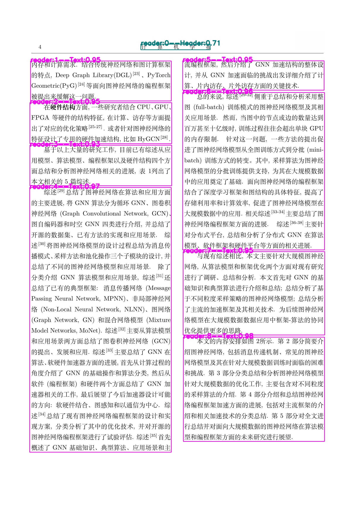

# LayoutReader

- modelscope：[阅读顺序模型 · 模型库 (modelscope.cn)](https://www.modelscope.cn/models/yujunhuinlp/LayoutReader-only-layout-large/summary)
- Github: https://github.com/yujunhuics/LayoutReader
- 使用方法：见Github
## 示例

